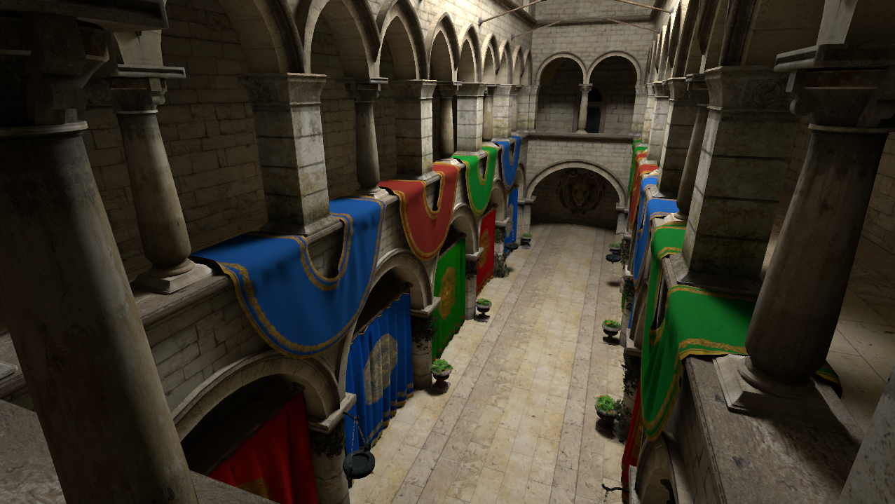

Demo for the I3D2020 paper *Stochastic Substitute Trees for Real-Time Global Illumination*.

https://dl.acm.org/doi/10.1145/3384382.3384521

The demo uses the [Falcor](https://github.com/nvidiagameworks/falcor) framework.

## Requirements
* Windows 10
* Visual Studio 2017
* DXR graphics card (no fallback)
* CUDA 10.0
* cuDNN 7.5
* TensorRT 5.1.5.0 (Visual studio looks for a custom environment variable TENSORRT_PATH pointing to the path. You will have to add this variable or place the files somewhere visible so that the compiler/linker can find them.)

## Build and run
* Open Falcor/Falcor.sln
* Switch to build configuration: ReleaseD3D12 x64
* Choose Samples/SSTDemo as startup project
* Hit run

## Controls
* WASD
* CTRL/Shift: for slow/fast movement
* Hold left mouse button to look around
* Mouse wheel: zoom
* P: show profiler

## Further notes
* The demo comes with different scenes (see folder Falcor/Scenes). Scenes can be loaded via the GUI.
